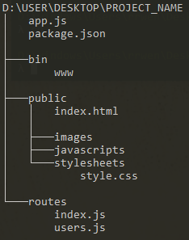

# tutorial-express-leaflet

Richard Wen <rwen@ryerson.ca>  
  
A tutorial for creating a leaflet webmap with express in Node.js

## 1. Install Software

**Step 1.1** Install [Node.js](https://nodejs.org/)
**Step 1.2** Install [express-generator](https://www.npmjs.com/package/express-generator) globally `-g` with [npm](https://docs.npmjs.com/cli/install)
**Step 1.3** Check that the `express` command works by using the `-h` help option

```
npm install -g express-generator
express -h
```

## 2. Create an express project

**Step 2.1** Open a [command line interface](https://en.wikipedia.org/wiki/Command-line_interface):


**Step 2.2** Create an express project with the `express` command, replacing `<project_name>` with the name of your project:

* `<project_name>` should be a valid folder name with no spaces and starting with a letter

```
express <project_name>
```

**Step 2.3** A folder named `<project_name>` will be created with the following structure inside (note that the structure may change with `express --version` that is not 4.16.0):



* `/bin`: folder containing executable code
	* `www`: executable file for starting the server
* `/public`: folder containing files served to the client side or front end
	* `/images`: folder containing images to be served to clients
	* `/javascripts`: folder containing [JavaScript](https://www.w3schools.com/js/) code files to be served to clients
	* `/stylesheets`: folder containing [Cascading Style Sheets (CSS)](https://www.w3schools.com/css/) files to be served to clients
* `/routes`: folder containing JavaScript files for defining [routes](https://expressjs.com/en/guide/routing.html) that direct how the server responds to client requests (these files are often used in file `app.js`)
	* `index.js`: defines the response to client requests at `<address>/` depending on how it is used in file `app.js`
	* `users.js`: defines the response to client requests at `<address>/users` depending on how it is used in file `app.js`
* `/views`: [template files](https://expressjs.com/en/guide/using-template-engines.html) ((jade)[http://jade-lang.com/] by default) for defining how the user will see the html pages served to them
	* `error.jade`: template file for displaying an error page
	* `index.jade`: template file for displaying the landing page `<address>/`
	* `layout.jade`: template file for defining the overall layout of the html content
* `app.js`: JavaScript file that contains code needed to create and run your express server or application
* `package.json`: [JSON](https://www.json.org/) structured [package file](https://docs.npmjs.com/files/package.json) holding all the dependencies and information about your project (can be modified with the [npm](https://docs.npmjs.com/cli/npm) command)

## 